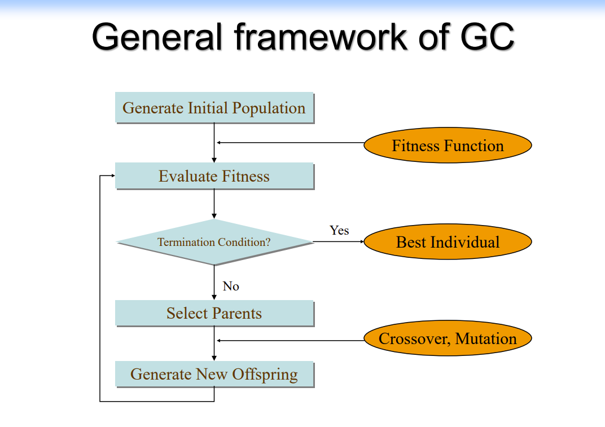

[TOC]

# Genetic Algorithm

## Vocabulary

- Individual: Any possible solution

- Population: Group of all individuals

- Fitness: Target function that we are optimizing(each individual has a fitness)

- Trait: Possible aspect(features) of an individual

- Genome: Collection of all chromosomes(traits) for an individual

## Basic Genetic Algorithm

- Start with a large "population" of randomly generated "attempted solutions" to a problem

- Repeatedy do the following:
    - Evaluate each of the attempted solutions
    - (probabilistically)keep a subset of the best solutions
    - Use these solutions to generate a new population(crossover)

- Quit when you have a satisfactory solution(or you run out of time)

## Examples

Refer to contents starting from page 54 in slide.

## MSA 建模

将每一条序列中空位（GAP）的位置作为遗传编码序列，例如使用一个和序列等长的数组，对应位置的数字表示其后的 GAP 数量。由于这样无法考虑到第一个字符前可能的 GAP，所以设置数组时要多一位。

三种遗传算子：

- crossover

- mutation

- offset(新旧值差距在限定范围内的 mutation)

结束条件很重要，这里可以设置为 50 轮都没有出现 fitness 更好的结果

## 运行心得

没有办法确保得到正确结果的，因为遗传算法很玄学

参数设置很重要

时间差异可能很大

很容易陷入局部最优解，要运行很多次才能得到一个最优解